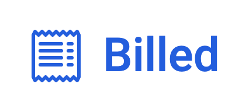
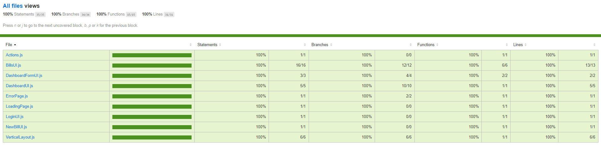
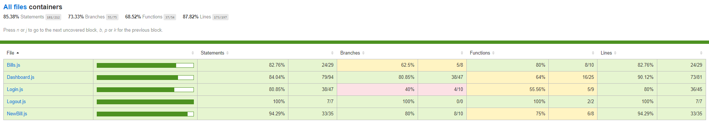

# Billed

## _Debug and test an HR SaaS_ 📊

## Table of Contents
  - [Description](#description)
  - [Bug report](#bug-report)
    - [Bills](#bills)
    - [Login](#login)
  - [Bug hunt](#bug-hunt)
    - [Bills](#bills-hunt)
    - [Dashboard](#dashboard)
  - [Units and integration tests](#units-and-integration-tests)
  - [End to End plan](#end-to-end-plan)
  - [Author info](#author-info)
---

## Description

__*Billed*__ is the ninth project I made during this training. As a front-end developer, I replaces a front-end developer who left the company before finishing the application he was working on. The goals 🎯 of this project was to, firstable, understand the code base that had already been implemented and its logic. And secondly, I had some [issues](https://www.notion.so/a7a612fc166747e78d95aa38106a55ec?v=2a8d3553379c4366b6f66490ab8f0b90) to solve.   

For this purpose, I had at my disposal a description of the [fonctionnalities](./readMe/fonctionalities.pdf) that I was working on, the [code base](https://github.com/OpenClassrooms-Student-Center/Billed-app-FR), the [mockup](https://www.figma.com/file/xqeE1ZKlHUWi2Efo8r73NK/UI-Design-Les-Petits-Plats-FR) and an example of [End to end plan](./readMe/e2e_plan.pdf).

[Back to the top](#billed)

---

## Bug-report

### Bills

the bug concerned the bills that the user could add, which were not ordered in chronological order. so the goal was to find where to implement this feature. The file src/views/BillsUI.js was concerned by this bug !

> fixed bug report [here](https://github.com/Roy-Framery-s-Openclassrooms-projects/RoyFramery_9_031221/commit/6846028b9b3e6c3914aa5dbf764d998ef5a521f7)

### Login

the bug concerned the admin's login that wan'st working. The file scr/containers/Login.js was concerned by this bug !

> fixed bug report [here](https://github.com/Roy-Framery-s-Openclassrooms-projects/RoyFramery_9_031221/commit/7fedf340373056ba380a5922814ab3c8ed90132d)

[Back to the top](#billed)

---
## Bug-hunt
### Bills-hunt
the bug concerned a display problem regarding the receipt of the bill. The goal here was to check the type of the file before to check the file type before sending it to the database. src/containers/NewBill.js was manly concerned by this bug, but I made some modifications in CSS and in the View.

> fixed bug hunt [here](https://github.com/Roy-Framery-s-Openclassrooms-projects/RoyFramery_9_031221/commit/05c2dbd5d24db0c2eafda3c93be72322a40f7487)

### Dashboard
the bug concerned admin's Dashboard. A bad behavior was observed in a particular scenario. When the admin clicks on a drop-down, it opens, he clicks on a bill to open it and then clicks on another drop-down, then it was impossible for him to open a bill that was in the first drop-down.The file scr/containers/Dashboard.js was concerned by this bug !

> fixed bug hunt [here](https://github.com/Roy-Framery-s-Openclassrooms-projects/RoyFramery_9_031221/commit/05c2dbd5d24db0c2eafda3c93be72322a40f7487)

[Back to the top](#billed)

---
## Units and integration tests
One of the goal of this project was to implement tests for severals files to cover the mains fonctionality.
To implement the tests, the [Jest](https://jestjs.io/fr/) framework was used with [@testing-library/jest-dom](https://testing-library.com/).

Was concerned :
- views/bills : a 100% coverage rate was expected
- containers/Bills : 
  - a coverage rate of around 80% was expected about statement 
  - add a GET Bills integration test
- containers/NewBill : 
  - a coverage rate of around 80% was expected about statement
  - add a POST new bill integration test

### views/bills
> added tests [here](https://github.com/Roy-Framery-s-Openclassrooms-projects/RoyFramery_9_031221/commit/f74f585c3377ec997c17313f0ab89632dd64193e)
> 
### container/Bills
> added tests [here](https://github.com/Roy-Framery-s-Openclassrooms-projects/RoyFramery_9_031221/blob/main/src/__tests__/Bills.js)
> 
### container/NewBill
> added tests [here](https://github.com/Roy-Framery-s-Openclassrooms-projects/RoyFramery_9_031221/blob/main/src/__tests__/NewBill.js)
> 

[Back to the top](#billed)

---
## End to End plan

The last issues to make for this project, was to realise a [E2E plan](./readMe/employee_E2E_plan.pdf) about the employee pathway.

[Back to the top](#billed)

---

## Author info 
🧑‍🎓 Roy Framery
- [LinkedIn](https://www.linkedin.com/in/roy-framery/)

[Back to the top](#billed)